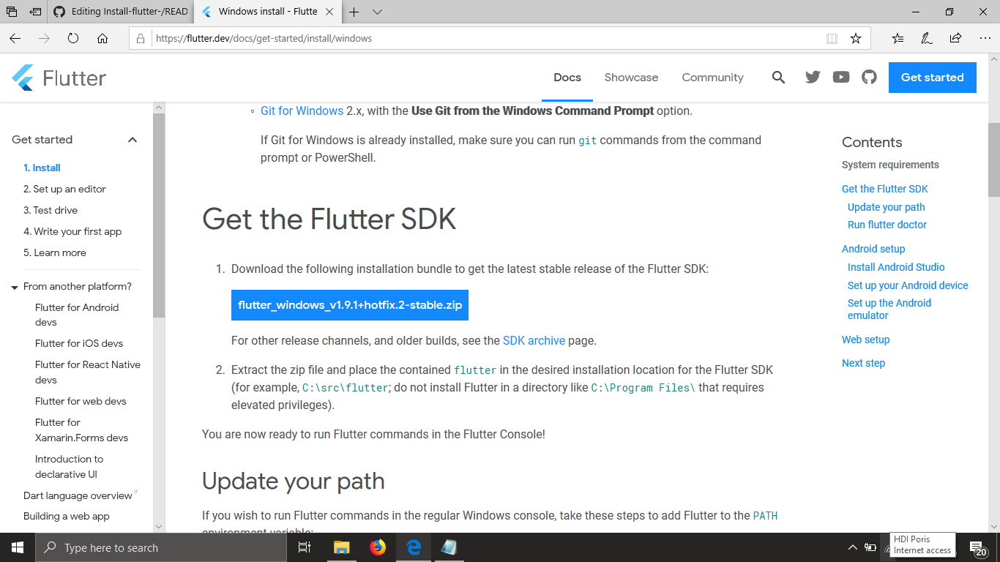
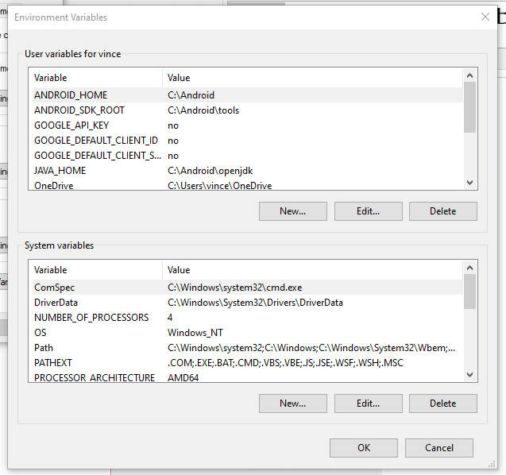
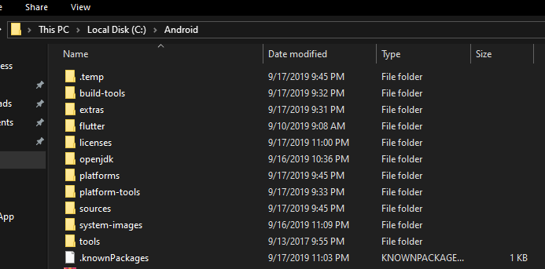
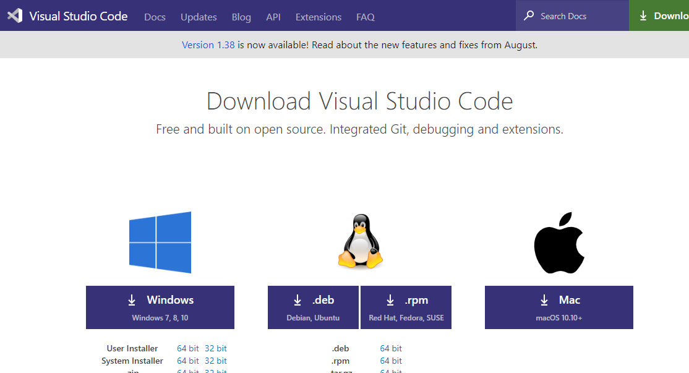
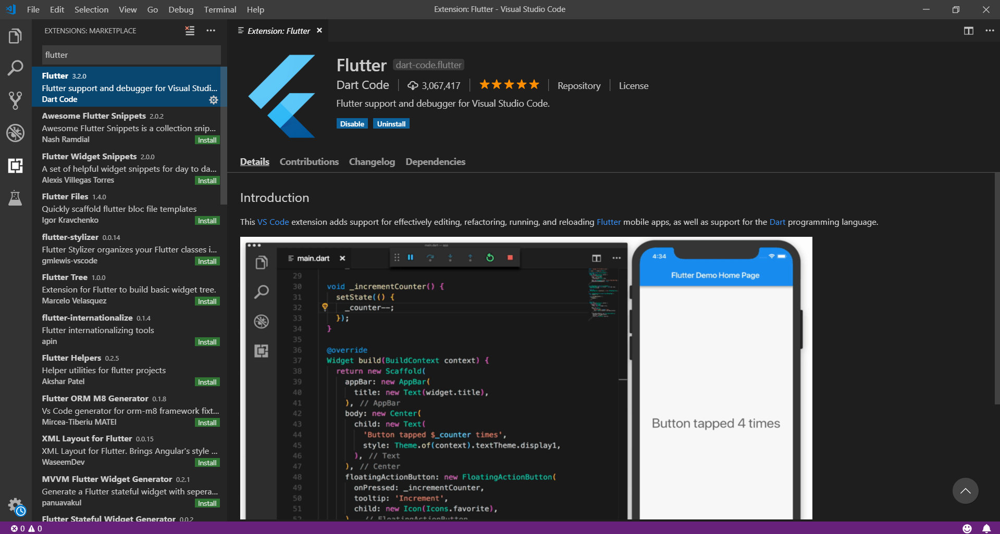
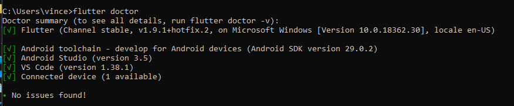

# Install Flutter di Windows 10
Nama    : Vincent Julindra Jacob  
NIM     : 20175520007  
Program Studi Teknik Informatika 2017  
Mata Kuliah Pemrograman Mobile 

## Tentang Flutter
Flutter adalah sebuah framework aplikasi mobil sumber terbuka yang diciptakan oleh Google. Flutter digunakan dalam pengembangan aplikasi untuk sistem operasi Android dan iOS, serta menjadi metode utama untuk membuat aplikasi Google Fuchsia.  

## Jangan Khawatir Jika Laptop Kamu Low Spec, Kita Bisa Install Flutter tanpa pakai Android Studio (yang terkenal berat untuk di jalankan) . Berikut Langkah-langkah install Flutter Tanpa Android Studio : 
- Download SDK Flutter.
  Silahkan kunjungi halaman download <a href="https://flutter.dev/docs/get-started/install/windows"> disini </a>, dan sesuaikan dengan sistem operasi teman-teman. Saat tulisan ini dibuat flutter dalam versi 1.9.1 Stable.  
 Penampakannya seperti berikut :  
 
 - Selanjutnya download Command Line Tools Only <a href="https://developer.android.com/studio/#command-tools" > disini </a>, penampakan nya seperti berikut, silahkan download sesuai sistem operasi yang digunakan.
 
  
 - Buat Folder bernama "Android" di Local Disk C: .  
 
 - Silahkan Ekstrak kedua file yang kamu sudah download sebelumnya dan letakkan di C:\Android untuk windows dan untuk sistem operasi yang lainnya bisa menaruh di root dan buat folder Android. Maka hasilnya akan ada 2 folder yaitu folder flutter dan tools.
 
 - Selanjutnya silahkan download OpenJDK <a href="https://github.com/AdoptOpenJDK/openjdk8-binaries/releases">disini</a>, dan pilih yang berekstensi zip. sesuaikan dengan sistem operasi yang digunakan, saya menggunakan versi jdk1.8.0_201 . setelah di download jangan lupa untuk mengekstrak ke folder Android yang sudah kita punya sebelumnya dan rename nama folder dari jdk1.8.0_201 menjadi openjdk. totalnya sekarang kita punya 3 folder yaitu flutter, tools dan openjdk.
 
 - sampai sini kita harus menge-set Environment Variable dan Path, untuk windows silahkan buka command prompt dan ketikan command perbaris.  
 <code> setx JAVA_HOME “C:\Android\openjdk” </code> 
 <code> setx ANDROID_HOME “C:\Android” </code>   
 <code> setx ANDROID_SDK_ROOT “C:\Android\tools” </code> 
 <code> setx path “%path%;”C:\Android\sdk;C:\Android\tools\bin;C:\Android\flutter\bin” </code>  
 Setelah anda melakukan command diatas, anda bisa cek Enviroment Variables komputer anda , terlihat di JAVA_HOME, ANDROID_HOME , ANDROID_SDK_ROOT dan di PATH sudah berubah sesuai dengan yang kita set.  
 
- Buka terminal (Command Prompt) di C:/Android/tools/bin lalu ketikan beberapa perintah berikut. (Anda memerlukan koneksi internet)   
<code> sdkmanager “system-images;android-28;default;x86_64” </code>   
  <code> sdkmanager “platform-tools” </code> 
 <code> sdkmanager “build-tools;28.0.3” .</code> 
 <code> sdkmanager “platforms;android-28” </code> 
 Setelah semua code diatas selesai, anda bisa cek Folder Android, ada banyak folder baru hasil download di command diatas.  
 
  untuk pengguna Mac silahkan jalankan dengan single qoute (petik satu) seperti berikut.  
  <code> sdkmanager ‘system-images;android-28;default;x86_64’ </code>  
  untuk SDK sendiri, Flutter selalu memerlukan Android SDK yang terbaru. jadi silahkan update sdk dengan command :  
  <code> sdkmanager —-update </code>  
  Jangan lupa untuk menjalankan syntax accept licenses nya    
  <code> flutter doctor --android-licenses </code>  
 -  Selanjutnya install Visual Studio Code <a href="https://code.visualstudio.com/download">disini</a>. Sesuaikan dengan operasi sistem yang anda gunakan.   
    
 - Jalankan Visual Studio Code, download dan install plug-in Flutter beserta ekstension Dartnya seperti gambar dibawah ini.
    
 -  Colok Smartphone anda ke laptop dengan kabel USB, jangan lupa untuk mengaktifkan USB Debugging di Developer Options smartphone anda.
(Jika Developer Option tidak bisa anda temukan, anda bisa unlock Developer Option dengan pergi ke bagian About Phone, klik 8x Build Number sampai ada tulisan "Anda sekarang menjadi pengembang/Now you are a developer" , maka Developer Options sudah terbuka.)  
 - Jika semuanya sudah selesai silahkan buka terminal (Command Prompt) di Android/flutter atau untuk pengguna windows bisa double klik di C:\Android\Flutter\flutter_console.bat dan jalankan perintah <code> flutter doctor </code>, maka hasilnya seperti gambar berikut.      Abaikan saja jika Android studio tidak terinstall karena kita tidak menggunakannya, atau jika anda ingin melihat yang lengkap bisa mengetikkan perintah <code> flutter doctor -v </code> , hasilnya seperti berikut  
  
 
 ##Instalasi Dart
- Buka Command Prompt, ketikkan code berikut  
<code> setx path "%path%"
</code>
- Setelah itu restart Command Prompt. Ketikkan code  
<code> dart </code>  
Maka akan muncul seperti gambar dibawah 
- Setelah itu buat Folder bernama "latihan_dart" Di Local Disk C
- Di dalam folder latihan_dart buat sebuah folder bernama kodedart_1 .
- Buka Visual Studio Code kamu lalu ketikkan code , Open folder latihan_dart , lalu buat file di dalam folder kodedart_1 bernama "hello dart" 
<code> 
void main(){
 Print("Hello World");
}  
</code>
- Simpan, lalu di Command Prompt, arahkan ke C:/latihan_dart/kodedart_1 .
- Masukkan kode
<code> 
Dart hello.dart
</code> 
- Maka akan muncul seperti gambar dibawah, dengan ini artinya dart sudah terinstall
## Selesai, Flutter dan Dart telah sukses kamu install! Selamat bekerja.
